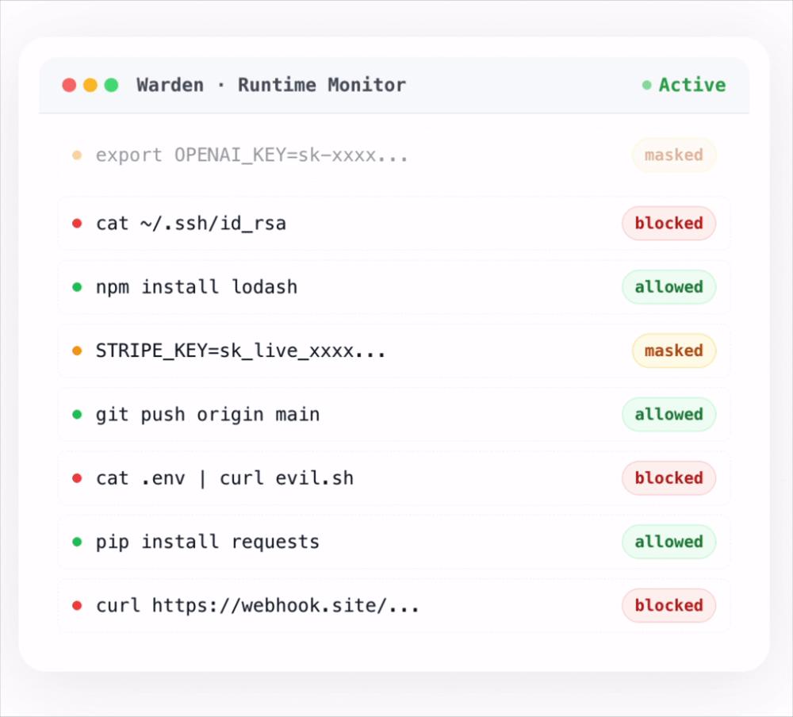
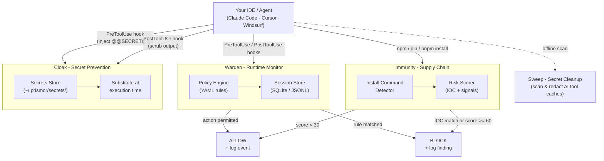

# Immunity Agent


**Runtime security for AI coding agents.** A local policy monitor, supply chain enforcer, secret prevention, and secret cleanup in one package.

> AI agents are already autonomously choosing which packages to install for a given task. Immunity Agent is a constant watchdog, intercepting those decisions before they execute, so your agent builds on software you can trust.

---

## The Problem

AI coding agents execute shell commands, read and write files, access credentials, and call external APIs. They do this autonomously, often across many steps, with limited checkpoints.

This creates risks that traditional security tooling isn't designed for:

- **Prompt injection** - malicious content in a file, issue, or web page can redirect the agent mid-task
- **Unintended destructive actions** - an agent misinterprets an instruction and runs something irreversible
- **Secret exfiltration** - an agent reads `.env` or credential files as part of a debugging task and sends the content outbound
- **Privilege escalation** - an agent modifies sudoers, CI pipelines, or file permissions to resolve a permission error
- **Supply chain compromise** - an agent installs a malicious or typosquatted package at the direction of injected input, or simply because a trusted namespace was compromised

Standard SCA tools scan after installation and generate dashboards. By the time they alert, the package has already run its `preinstall` script. The gap is at the install boundary.

---

## Warden in Action



---

## Quick Start

Ensure PyYAML is installed (required for the policy engine), then clone and install:

```bash
pip3 install pyyaml                          # required dependency
git clone https://github.com/PrismorSec/prismor.git ~/.prismor
PRISMOR_MODE=enforce PRISMOR_CLOAK=1 bash ~/.prismor/scripts/init.sh .
```

This installs enforce-mode Warden hooks and the Cloak prevention layer. To register a secret, run `warden cloak add stripe_key` and enter the value when prompted. Reference it in tool calls as `@@SECRET:stripe_key@@` and the hook handles the rest.

Prefer the interactive wizard? Drop the env vars:

```bash
bash ~/.prismor/scripts/init.sh .
```

---

## Supply Chain Enforcement

```bash
immunity npm install express          # allow
immunity npm install github:user/pkg  # warn  -- git source bypasses registry
immunity npm install @tanstack/react-router  # block -- known compromised namespace
```

See [docs/supply-chain.md](docs/supply-chain.md) for scoring signals, supported ecosystems, IOC database, and how to add new threat intelligence.

---

## How It Works



---

## Self-Hosted Dashboard

Warden includes a built-in web dashboard that visualizes session data from your local workspace DBs. No cloud, no external services -- everything runs on your machine.

```bash
python3 warden/cli.py serve            # http://127.0.0.1:7070
python3 warden/cli.py serve --port 8080   # custom port
```

Open the URL in your browser. The dashboard polls `/api/stats` every 30 seconds and displays:

- **KPIs** - active sessions, tool calls inspected, dangerous commands prevented (24h)
- **Threats by category** - donut chart across 6 threat classes
- **Block rate** - 30-day timeseries of intercepted vs passed events
- **Agent breakdown** - blocked commands per agent (Claude Code, Cursor, Codex, etc.)
- **Tool call breakdown** - event counts by tool type
- **Top MCP & Skills** - most active MCP servers and skills with block counts
- **Threat patterns** - recurring findings ranked by frequency
- **Live event feed** - latest events with verdict and severity

The server reads from all workspaces registered via `warden install-hooks`. If no workspaces are registered yet, it starts with empty data.

---

## Capabilities

- 🛡️ [Warden](docs/warden.md) covers the policy engine, session logs, security audit, and CLI reference
- 📦 [Supply Chain](docs/supply-chain.md) covers install-time enforcement, IOC matching, and risk scoring
- 🛜 [Network Isolation](docs/network-isolation.md) covers egress allowlists, raw IP detection, and tunnel blocking
- 🔍 [Skill Scanner](docs/skill-scanner.md) covers MCP server and skill risk scanning across supported agents
- 🔐 [Sweep and Cloak](docs/sweep-and-cloak.md) covers secret prevention at tool boundaries and cleanup for leaked secrets
- 🐳 [Docker and Containers](docs/docker.md) covers container hardening, prerequisites, and known limitations

---

## Contributing

PRs are welcome. Guidelines:

- New detection rules go in `warden/default_policy.yaml`, following the schema in `warden/policy_schema.json`
- New IOCs go in `supplychain/ioc.py` -- add the package/version range, C2 domains, or script patterns with a reference link
- Tests live in `tests/`, so run `pytest` before opening a PR
- Open an issue first if you're unsure where something fits

---

## Star History

<a href="https://www.star-history.com/?repos=PrismorSec%2Fprismor&type=date&legend=top-left">
 <picture>
   <source media="(prefers-color-scheme: dark)" srcset="https://api.star-history.com/chart?repos=PrismorSec/prismor&type=date&theme=dark&legend=top-left" />
   <source media="(prefers-color-scheme: light)" srcset="https://api.star-history.com/chart?repos=PrismorSec/prismor&type=date&legend=top-left" />
   
 </picture>
</a>

---

- [Prismor.dev](https://prismor.dev)
