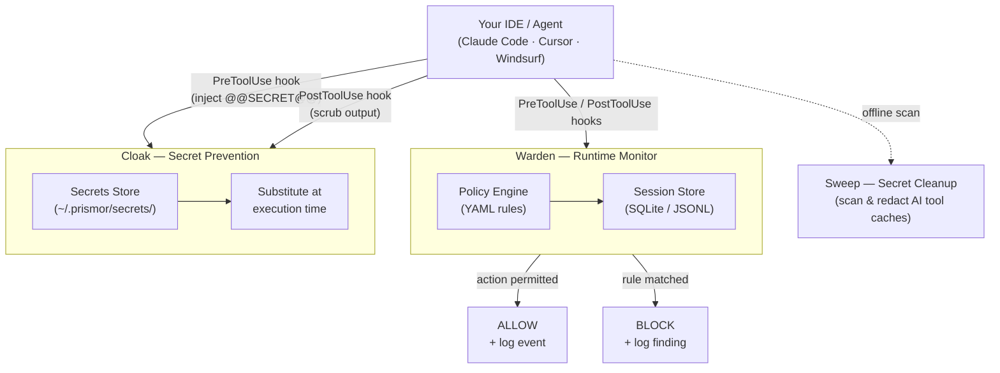

# Immunity Agent


**Runtime security for AI coding agents.** A local policy monitor, secret prevention, and secret cleanup in one package.

---

## The Problem

AI coding agents execute shell commands, read and write files, access credentials, and call external APIs. They do this autonomously, often across many steps, with limited checkpoints.

This creates risks that traditional security tooling isn't designed for:

- **Prompt injection** - malicious content in a file, issue, or web page can redirect the agent mid-task
- **Unintended destructive actions** - an agent misinterprets an instruction and runs something irreversible
- **Secret exfiltration** - an agent reads `.env` or credential files as part of a debugging task and sends the content outbound
- **Privilege escalation** - an agent modifies sudoers, CI pipelines, or file permissions to resolve a permission error
- **Dependency manipulation** - an agent installs or rewrites a package at the direction of injected input

Standard OS-level and endpoint security tools monitor the kernel and filesystem. By the time they see an action, the agent has already decided to take it. The gap is at the agent layer.

---

## Quick Start

Ensure PyYAML is installed (required for the policy engine), then clone and install:

```bash
pip3 install pyyaml                          # required dependency
git clone https://github.com/PrismorSec/prismor.git ~/.prismor
PRISMOR_MODE=enforce PRISMOR_CLOAK=1 bash ~/.prismor/scripts/init.sh .
```

This installs enforce-mode Warden hooks and the Cloak prevention layer. To register a secret, run `warden cloak add stripe_key` and enter the value when prompted. Reference it in tool calls as `@@SECRET:stripe_key@@` and the hook handles the rest.

Prefer the interactive wizard? Drop the env vars:

```bash
bash ~/.prismor/scripts/init.sh .
```

## How It Works



---

## Capabilities

- 🛡️ [Warden](docs/warden.md) covers the policy engine, session logs, security audit, and CLI reference
- 🛜 [Network Isolation](docs/network-isolation.md) covers egress allowlists, raw IP detection, and tunnel blocking
- 🔍 [Skill Scanner](docs/skill-scanner.md) covers MCP server and skill risk scanning across supported agents
- 🔐 [Sweep and Cloak](docs/sweep-and-cloak.md) covers secret prevention at tool boundaries and cleanup for leaked secrets
- 🐳 [Docker and Containers](docs/docker.md) covers container hardening, prerequisites, and known limitations

---

## Contributing

PRs are welcome. Guidelines:

- New detection rules go in `warden/default_policy.yaml`, following the schema in `warden/policy_schema.json`
- Tests live in `tests/`, so run `pytest` before opening a PR
- Open an issue first if you're unsure where something fits

---

## Star History

<a href="https://www.star-history.com/?repos=PrismorSec%2Fprismor&type=date&legend=top-left">
 <picture>
   <source media="(prefers-color-scheme: dark)" srcset="https://api.star-history.com/chart?repos=PrismorSec/prismor&type=date&theme=dark&legend=top-left" />
   <source media="(prefers-color-scheme: light)" srcset="https://api.star-history.com/chart?repos=PrismorSec/prismor&type=date&legend=top-left" />
   
 </picture>
</a>

---

- [Prismor.dev](https://prismor.dev)
