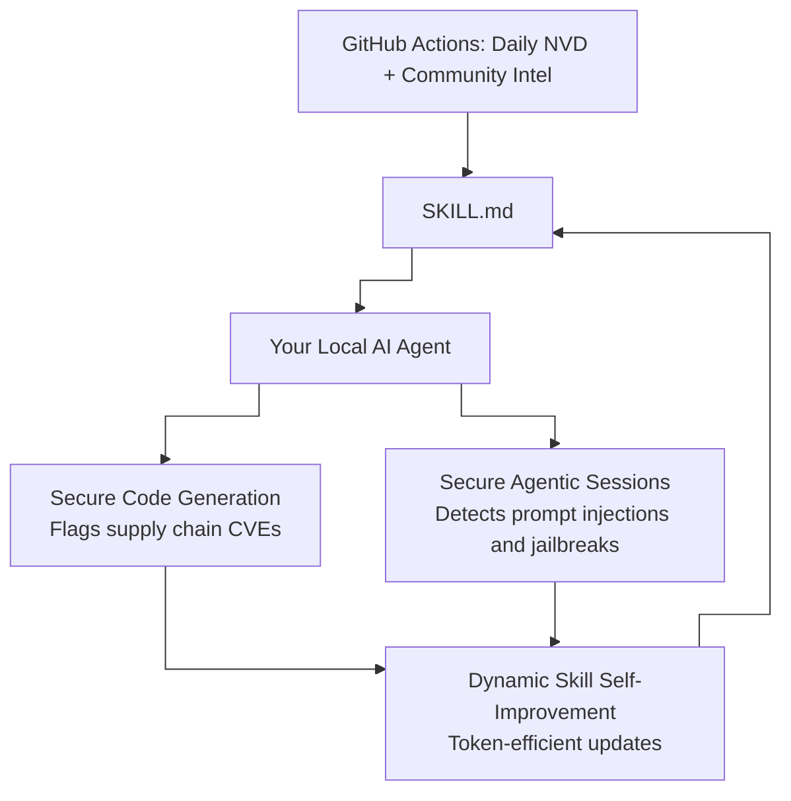

# immunity-agent


[](https://discord.gg/8rBwhz6T)

## The Problem

AI coding agents are writing and running code every day, but they have no built-in awareness of the vulnerabilities specific to the AI ecosystem: prompt injections, jailbreaks, and CVEs in the frameworks they themselves depend on. They are powerful but flying blind on security.

At the same time, developers have no simple way to hand their agent a living security reference and say "use this when you write and review code." Static guides go outdated the moment they are written. A feed that updates itself does not.

## The Two Use Cases This Solves

**1. Secure code generation.** When your agent writes or reviews code, it checks the live feed for known supply chain vulnerabilities in your dependencies, flagging insecure patterns before they reach your codebase.

**2. Secure agent sessions.** When your agent is executing tasks autonomously, it is aware of prompt injection techniques, jailbreak vectors, and CVEs that could compromise the session itself, not just the code it produces.

The same skill file covers both. Your agent does not need separate configuration for each.

## The Solution

**immunity-agent** is an open-source intelligence pipeline that gives any AI coding agent a continuously refreshed security skill. It polls the National Vulnerability Database daily for CVEs affecting the AI ecosystem, merges community-submitted threat intelligence, cryptographically signs the output, and publishes it all to a single file your agent can read.

The skill is dynamic. It can self-improve its own instructions as your use case evolves, and the update mechanism is optimized to be token-efficient so your agent only processes what has changed.



## How to Use

### 1. Clone the repository

```bash
git clone https://github.com/prismorsec/immunity-agent.git
cd immunity-agent
```

### 2. Point your agent to the skill

Tell your AI coding agent of choice (Claude Code, Cursor, Windsurf, Copilot, or any other) to read the skill file:

```
Read skills/prismor-feed/SKILL.md and follow its instructions.
```

That is all your agent needs. The skill file tells it how to fetch the live feed, parse it, and apply it whether it is writing code or running an autonomous session.

### 3. Query the feed directly

```bash
# Install Python dependencies
pip install -r requirements.txt

# Count all tracked advisories
bash scripts/query_feed.sh count

# List only critical severity advisories
bash scripts/query_feed.sh critical

# Show advisories published in the last 7 days
bash scripts/query_feed.sh recent
```

### 4. Verify the feed is genuine

The feed is signed with an Ed25519 key on every update. Before trusting any advisory programmatically, verify it:

```bash
# Decode the signature
openssl base64 -d -A -in advisories/immunity-feed.json.sig -out signature.bin

# Verify against the public key
openssl pkeyutl -verify -pubin -inkey public.pub -rawin \
  -in advisories/immunity-feed.json -sigfile signature.bin
```

A `Signature Verified Successfully` response means the feed is authentic and unmodified.

## Why immunity-agent

There are other open-source security skills and vulnerability databases out there. Here is how this one is different.

**It never goes obsolete.** Most skills are markdown files written once and forgotten. immunity-agent is backed by a live pipeline. Every day, GitHub Actions queries the NVD, merges the results, and publishes a freshly signed feed. Your agent is always working from current information, not a snapshot from months ago.

**The skill itself can self-improve.** Your agent is designed to update `SKILL.md` based on what it learns about your specific stack and use case. This is not possible with a static guide or a one-time audit tool.

**It is written for agents, not just humans.** The feed format, the query scripts, and the SKILL.md instructions are all designed to be parsed and acted on by an AI agent without human intervention. Other repositories document vulnerabilities for people to read. This one is a machine-readable input for your agent's decision-making.

**It covers the AI ecosystem specifically.** General vulnerability databases cover everything. This feed filters for CVEs and threat patterns that affect AI frameworks: LangChain, LlamaIndex, OpenAI SDKs, prompt injection patterns, jailbreaks, and similar vectors that standard dependency scanners miss.

**Token efficiency matters.** The self-improvement loop is lean. Your agent fetches only what it needs and updates only what has changed, keeping context usage low.

## Repository Layout

| Path | What it does |
|------|--------------|
| `skills/prismor-feed/SKILL.md` | The skill your agent reads and can self-improve |
| `advisories/immunity-feed.json` | The signed, live intelligence feed |
| `advisories/immunity-feed.json.sig` | Ed25519 signature for the feed |
| `scripts/fetch_nvd_intel.py` | Queries NVD for AI ecosystem CVEs |
| `scripts/merge_intel.py` | Deduplicates and validates new advisories |
| `scripts/sign_feed.sh` | Produces the cryptographic signature |
| `scripts/query_feed.sh` | Convenience query tool for humans and agents |
| `schemas/threat-object.schema.json` | JSON Schema governing the advisory format |
| `.github/workflows/` | GitHub Actions pipelines that run everything daily |
| `AGENTS.md` | Instructions specifically for AI agents operating in this repo |

## Community and Enterprise

Join the community on [Discord](https://discord.gg/8rBwhz6T) to submit threat intel, share findings, and discuss how you are using immunity-agent in your own agent setups.

For enterprise-grade security across your entire codebase, check out [Prismor](https://prismor.dev), the full platform built on this intelligence feed.

If you have discovered a novel threat vector, a new jailbreak pattern, or a CVE not yet in the feed, open an issue using the Threat Intelligence template. See [CONTRIBUTING.md](CONTRIBUTING.md) for details.