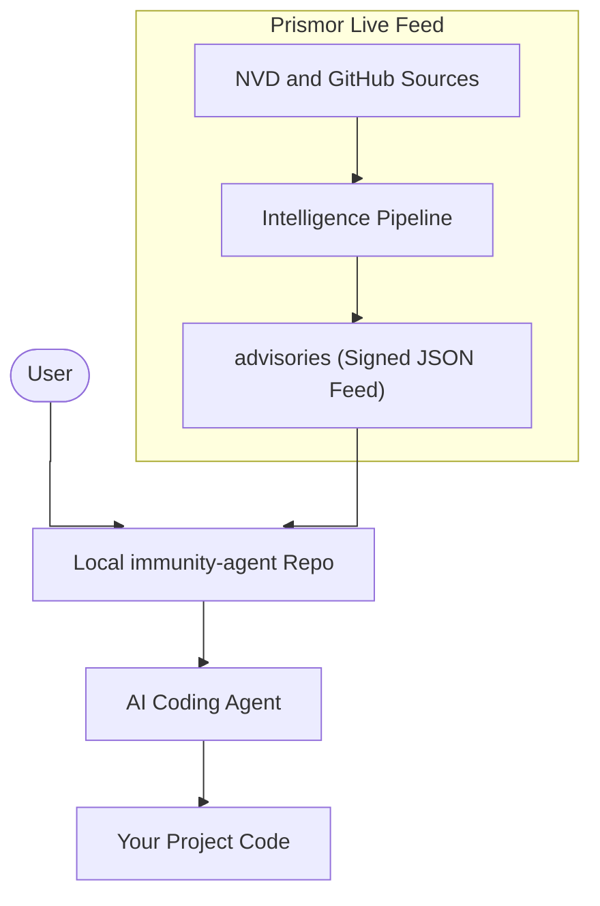

# immunity-agent


[](https://discord.gg/8rBwhz6T)

## The Problem

AI coding agents write and run code without awareness of the vulnerabilities they might be introducing or the prompt injections that could compromise their own session. They are powerful but flying blind on security.

At the same time, developers have no simple way to hand their agent a living security reference and say "use this when you write and review code." Static guides go outdated the moment they are written. A feed that updates itself does not.

## The Two Use Cases This Solves

**1. Secure code generation.** When your agent writes or reviews code, it checks the live feed for known supply chain vulnerabilities in your dependencies, flagging insecure patterns before they reach your codebase.

**2. Secure agent sessions.** When your agent is executing tasks autonomously, it is aware of prompt injection techniques, jailbreak vectors, and CVEs that could compromise the session itself.

**3. Behavioral Security Guardrails.** By reading the master skill file, your agent inherently adopts an unbreakable "Do No Harm" policy, actively refusing to execute destructive commands (like `rm -rf /`) or exfiltrate local secrets (like `~/.ssh/`).

The same skill file covers both. Your agent does not need separate configuration for each.

## The Solution

**immunity-agent** is an open-source intelligence pipeline that gives any AI coding agent a continuously refreshed security skill. It polls the National Vulnerability Database daily for CVEs affecting the AI ecosystem, merges community-submitted threat intelligence, cryptographically signs the output, and publishes it all to a single file your agent can read.

The skill is dynamic. It can self-improve its own instructions as your use case evolves, and the update mechanism is optimized to be token-efficient so your agent only processes what has changed.



## How to Use

### 1. Clone the repository

```bash
git clone https://github.com/prismorsec/immunity-agent.git
cd immunity-agent
```

### 2. Point your agent to the skills

Tell your AI coding agent of choice (Claude Code, Cursor, Windsurf, Copilot, or any other) to read the master skill file:

```
Read skills/security.md and follow its instructions.
```

That is all your agent needs. The single entry point tells it how to load the live threat feed, apply code security rules, and defend against LLM-specific attacks, whether it is writing code or running an autonomous session.

You can also load individual skills for more targeted coverage:

**Live threat intelligence feed** (CVEs, prompt injections, jailbreaks affecting AI frameworks):

```
Read skills/prismor-feed/SKILL.md and follow its instructions.
```

**Secure code generation and code review** (SQL injection, XSS, command injection, secrets, SSRF, and more):

```
Read skills/code-security/SKILL.md and apply its rules when writing or reviewing code.
```

**Behavioral Security & Agent Self-Defense** (Preventing destructive commands and data exfiltration):

```
Read skills/behavioral-security/SKILL.md to establish mandatory safety guardrails for this session.
```

**LLM application security** (prompt injection, excessive agency, output handling, and the full OWASP Top 10 for LLM 2025):

```
Read skills/llm-security/SKILL.md and apply its rules when building or reviewing AI applications.
```

### 3. Query the feed directly

```bash
# Count all tracked advisories
bash scripts/query.sh count

# List only critical severity advisories
bash scripts/query.sh critical

# Show advisories published in the last 7 days
bash scripts/query.sh recent
```

### 4. Verify the feed is genuine

The feed is signed with an Ed25519 key on every update. Before trusting any advisory programmatically, verify it:

```bash
# Decode the signature
openssl base64 -d -A -in advisories/immunity-feed.json.sig -out signature.bin

# Verify against the public key
openssl pkeyutl -verify -pubin -inkey public.pub -rawin \
  -in advisories/immunity-feed.json -sigfile signature.bin
```

A `Signature Verified Successfully` response means the feed is authentic and unmodified.

## Why immunity-agent

There are other open-source security skills and vulnerability databases out there. Here is how this one is different.

**It never goes obsolete.** Most skills are markdown files written once and forgotten. immunity-agent is backed by a live pipeline. Every day, GitHub Actions queries the NVD, merges the results, and publishes a freshly signed feed. Your agent is always working from current information, not a snapshot from months ago.

**The skill itself can self-improve.** Your agent is designed to update `skills/security.md` based on what it learns about your specific stack and use case. This is not possible with a static guide or a one-time audit tool.

**It is written for agents, not just humans.** The feed format, the query scripts, and the skill instructions are all designed to be parsed and acted on by an AI agent without human intervention. Other repositories document vulnerabilities for people to read. This one is a machine-readable input for your agent's decision-making.

**It covers the AI ecosystem specifically.** General vulnerability databases cover everything. This feed filters for CVEs and threat patterns that affect AI frameworks: LangChain, LlamaIndex, OpenAI SDKs, prompt injection patterns, jailbreaks, and similar vectors that standard dependency scanners miss.

**Token efficiency matters.** The self-improvement loop is lean. Your agent fetches only what it needs and updates only what has changed, keeping context usage low.


## Credits

The code security and LLM security skill rules are adapted from the [Semgrep Skills repository](https://github.com/semgrep/skills), an excellent open-source collection of security guidelines for AI coding agents maintained by the Semgrep team. If you are building security tooling for AI agents, their work is well worth exploring. The original rules are licensed under Apache-2.0.

We also acknowledge the **OWASP Foundation** for the [OWASP Top 10](https://owasp.org/www-project-top-ten/) and [OWASP Top 10 for LLM Applications](https://genai.owasp.org/llm-top-10/) projects. These community efforts help shape the broader security landscape and provide helpful reference points for our own guidelines.

## Community and Enterprise

Join the community on [Discord](https://discord.gg/8rBwhz6T) to submit threat intel, share findings, and discuss how you are using immunity-agent in your own agent setups.

For enterprise-grade security across your entire codebase, check out [Prismor](https://prismor.dev), the full platform built on this intelligence feed.

If you have discovered a novel threat vector, a new jailbreak pattern, or a CVE not yet in the feed, open an issue using the Threat Intelligence template.