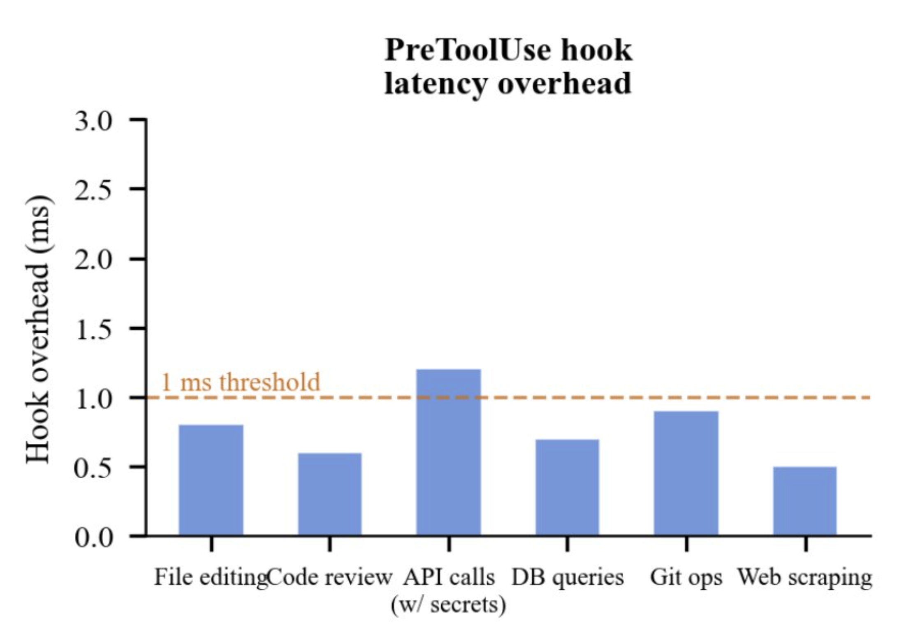
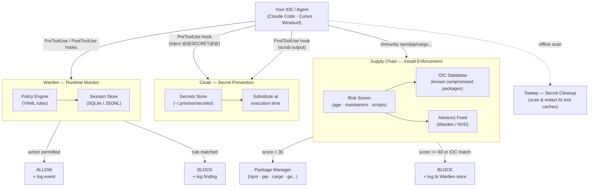

# Immunity Agent


**Runtime security for AI coding agents.** A local policy monitor, secret prevention, and secret cleanup in one package.


---

## The Problem

AI coding agents execute shell commands, read and write files, access credentials, and call external APIs. They do this autonomously, often across many steps, with limited checkpoints.

This creates risks that traditional security tooling isn't designed for:

- **Prompt injection** - malicious content in a file, issue, or web page can redirect the agent mid-task
- **Unintended destructive actions** - an agent misinterprets an instruction and runs something irreversible
- **Secret exfiltration** - an agent reads `.env` or credential files as part of a debugging task and sends the content outbound
- **Privilege escalation** - an agent modifies sudoers, CI pipelines, or file permissions to resolve a permission error
- **Dependency manipulation** - an agent installs or rewrites a package at the direction of injected input

Standard OS-level and endpoint security tools monitor the kernel and filesystem. By the time they see an action, the agent has already decided to take it. The gap is at the agent layer.

---

## Capabilities

- 🛡️ [Warden](docs/warden.md) covers the policy engine, session logs, security audit, and CLI reference
- 📦 [Supply Chain](docs/supply-chain.md) covers install-time enforcement, IOC matching, and risk scoring
- 🛜 [Network Isolation](docs/network-isolation.md) covers egress allowlists, raw IP detection, and tunnel blocking
- 🔍 [Skill Scanner](docs/skill-scanner.md) covers MCP server and skill risk scanning across supported agents
- 🔐 [Sweep and Cloak](docs/sweep-and-cloak.md) covers secret prevention at tool boundaries and cleanup for leaked secrets
- 🐳 [Docker and Containers](docs/docker.md) covers container hardening, prerequisites, and known limitations

---

## Benchmarks

We constructed a simulation harness that replays 10,000 representative agent sessions across five task categories: API integration (32%), infrastructure management (22%), database operations (14%), CI/CD setup (9%), and general development (23%). Each session was executed twice: once with Warden (immunity-agent) hooks active and once without.

Results across 10,000 sessions:


The measured overhead is 0.8 ms per tool call, below the 1 ms threshold for every task category tested. The 0.8 ms figure is dominated by shell process startup time. It is fixed regardless of command complexity. A simple sed substitution and a long multi-file build invocation produce identical hook overhead because the hook itself does the same work in both cases.



---

## Quick Start

Ensure PyYAML is installed (required for the policy engine), then clone and install:

```bash
pip3 install pyyaml                          # required dependency
git clone https://github.com/PrismorSec/prismor.git ~/.prismor
PRISMOR_MODE=enforce PRISMOR_CLOAK=1 bash ~/.prismor/scripts/init.sh .
```

This installs enforce-mode Warden hooks and the Cloak prevention layer. To register a secret, run `warden cloak add stripe_key` and enter the value when prompted. Reference it in tool calls as `@@SECRET:stripe_key@@` and the hook handles the rest.

Prefer the interactive wizard? Drop the env vars:

```bash
bash ~/.prismor/scripts/init.sh .
```

### Warden Modes

Warden runs in two modes, set via the `--mode` flag or the `PRISMOR_MODE` env var:

| Mode | Behavior |
|---|---|
| `observe` (default) | Logs all tool calls and findings. Never blocks. Safe for onboarding and auditing. |
| `enforce` | Blocks dangerous actions in real time before the agent executes them. |

Switch modes at any time by re-running the hook installer:

```bash
warden install-hooks --agent all --mode observe    # log only
warden install-hooks --agent all --mode enforce    # block dangerous actions
```

---

## Self-Hosted Dashboard

Warden includes a built-in web dashboard that visualizes session data from your local workspace DBs. No cloud, no external services — everything runs on your machine.

```bash
python3 warden/cli.py serve            # http://127.0.0.1:7070
python3 warden/cli.py serve --port 8080   # custom port
```

Open the URL in your browser. The dashboard polls `/api/stats` every 30 seconds and displays:

- **KPIs** — active sessions, tool calls inspected, dangerous commands prevented (24h)
- **Threats by category** — donut chart across 6 threat classes
- **Block rate** — 30-day timeseries of intercepted vs passed events
- **Agent breakdown** — blocked commands per agent (Claude Code, Cursor, Codex, etc.)
- **Tool call breakdown** — event counts by tool type
- **Top MCP & Skills** — most active MCP servers and skills with block counts
- **Threat patterns** — recurring findings ranked by frequency
- **Live event feed** — latest events with verdict and severity

The server reads from all workspaces registered via `warden install-hooks`. If no workspaces are registered yet, it starts with empty data.


---

## How It Works



---

## Supply Chain Enforcement

The `immunity` CLI wraps your package manager and evaluates every install against live threat intelligence before it runs. Unlike pnpm or other package managers, `immunity` is a security enforcement layer that scores packages on age, maintainer count, install scripts, and known IOCs, then blocks dangerous ones before they hit your disk. Ships with IOC coverage for the **mini-shai-hulud** attack (May 11 2026).

```bash
immunity npm install express                    # resolves cleanly, execs npm
immunity npm install @tanstack/react-router     # BLOCK — IOC match (score 100)
immunity pip install requests numpy             # resolves cleanly, execs pip
immunity pnpm add lodash
immunity uv add fastapi
immunity cargo add serde
```

Any command that isn't a recognised package install passes through transparently, so you can alias your package managers:

```bash
alias npm="python3 /path/to/immunity-agent/immunity npm"
alias pip="python3 /path/to/immunity-agent/immunity pip"
```

| What it checks | pnpm / npm | immunity |
|---|---|---|
| Install packages | ✅ | ✅ (passes through after checks) |
| Risk scoring (age, maintainer count, install scripts) | ❌ | ✅ |
| IOC database (known compromised packages and versions) | ❌ | ✅ |
| Advisory feed cross-check (Warden / NVD) | ❌ | ✅ |
| Install script content analysis | ❌ | ✅ |
| Hard block before install | ❌ | ✅ |
| Works across npm, pnpm, pip, uv, cargo, go | ❌ | ✅ |

Verdicts are additive: `< 30` allow · `30–59` warn · `≥ 60` block. IOC matches force a block regardless of score. See [docs/supply-chain.md](docs/supply-chain.md) for the full scoring table, ecosystem support, and how to add new IOCs.

---

## Contributing

PRs are welcome. Guidelines:

- New detection rules go in `warden/default_policy.yaml`, following the schema in `warden/policy_schema.json`
- Tests live in `tests/`, so run `pytest` before opening a PR
- Open an issue first if you're unsure where something fits

---

## Star History

<a href="https://www.star-history.com/?repos=PrismorSec%2Fprismor&type=date&legend=top-left">
 <picture>
   <source media="(prefers-color-scheme: dark)" srcset="https://api.star-history.com/chart?repos=PrismorSec/prismor&type=date&theme=dark&legend=top-left" />
   <source media="(prefers-color-scheme: light)" srcset="https://api.star-history.com/chart?repos=PrismorSec/prismor&type=date&legend=top-left" />
   
 </picture>
</a>

---

- [Prismor.dev](https://prismor.dev)
