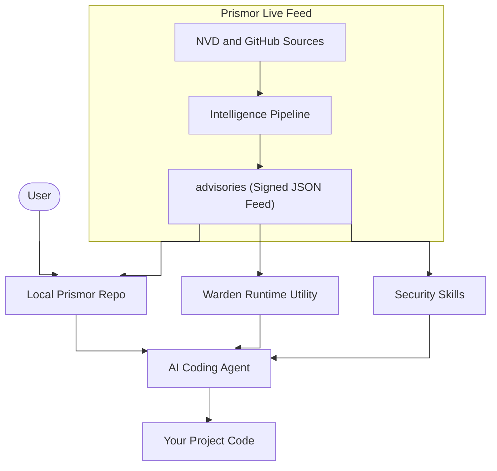

# Prismor


[](https://discord.gg/8rBwhz6T)

Prismor is a unified security package for AI coding agents.

It gives you three things that work together:

- a signed threat-intelligence feed for the AI ecosystem
- reusable security skills for agents
- a local Warden utility for live session monitoring and blocking

## Why It Exists

AI coding agents write and run code without awareness of the vulnerabilities they might be introducing or the prompt injections that could compromise their own session. They are powerful but flying blind on security.

At the same time, developers have no simple way to hand their agent a living security reference and say "use this when you write and review code." Static guides go outdated the moment they are written. A feed that updates itself does not.

## What Prismor Includes

### 1. Signed threat feed

Prismor maintains a signed advisory feed in [`advisories/immunity-feed.json`](advisories/immunity-feed.json) covering AI-specific vulnerabilities, prompt-injection patterns, jailbreaks, unsafe tool execution, and dependency issues.

### 2. Security skills

Prismor ships agent-readable skills in [`skills/`](skills/) so an assistant can adopt secure coding, LLM application security, behavioral guardrails, and live-feed awareness without you rewriting policy every session.

### 3. Warden runtime utility

Prismor Warden lives in [`warden/`](warden/) and gives you local runtime control:

- install hooks into supported agents
- capture local security-relevant events
- block obviously dangerous pre-action behavior in `enforce` mode
- store sessions and findings in SQLite
- correlate runtime findings with the local Prismor advisory feed

## Architecture

Prismor is an open-source security layer around the full AI-agent lifecycle: what the agent knows, how it behaves, and what it does at runtime.



## Quick Start

### 1. Clone Prismor

```bash
git clone https://github.com/PrismorSec/prismor.git
cd prismor
```

### 2. Give your agent the Prismor security skill

Tell your agent:

```text
Read skills/security.md and follow its instructions.
```

That single entry point loads the behavioral guardrails, live threat feed guidance, secure coding guidance, and LLM security rules.

### 3. Query the local feed

```bash
bash scripts/query.sh count
bash scripts/query.sh critical
bash scripts/query.sh recent
```

### 4. Use Warden for local session security

Prismor now includes a local utility for securing live agent sessions:

```bash
python3 warden/cli.py analyze --input warden/examples/sample-session.jsonl
python3 warden/cli.py ingest --input warden/examples/sample-session.jsonl
python3 warden/cli.py install-hooks --agent all --workspace "$(pwd)" --mode enforce
python3 warden/cli.py sessions --workspace "$(pwd)"
```

See [`warden/README.md`](warden/README.md) for the Warden-specific reference.

## How To Use Prismor

### Use case 1: Secure an agent before it starts working

Point the agent at [`skills/security.md`](skills/security.md):

- [`skills/behavioral-security/SKILL.md`](skills/behavioral-security/SKILL.md)
- [`skills/prismor-feed/SKILL.md`](skills/prismor-feed/SKILL.md)
- [`skills/code-security/SKILL.md`](skills/code-security/SKILL.md)
- [`skills/llm-security/SKILL.md`](skills/llm-security/SKILL.md)

This is the lowest-friction way to adopt Prismor.

### Use case 2: Inspect the threat feed directly

Use the feed when you want raw intelligence:

- count advisories
- list critical issues
- inspect recently published items
- verify signatures before programmatic trust

```bash
openssl base64 -d -A -in advisories/immunity-feed.json.sig -out signature.bin
openssl pkeyutl -verify -pubin -inkey public.pub -rawin \
  -in advisories/immunity-feed.json -sigfile signature.bin
```

### Use case 3: Monitor live runtime behavior with Warden

Warden is useful when you want Prismor to do more than provide guidance:

- install hooks into supported agents
- capture local security-relevant session events
- block obviously dangerous pre-action behavior in enforce mode
- store session findings in SQLite for review
- correlate local findings with the Prismor advisory feed

Core commands:

```bash
python3 warden/cli.py analyze --input warden/examples/sample-session.jsonl
python3 warden/cli.py ingest --input warden/examples/sample-session.jsonl --workspace "$(pwd)"
python3 warden/cli.py sessions --workspace "$(pwd)"
python3 warden/cli.py session --workspace "$(pwd)" --session-id <id>
python3 warden/cli.py install-hooks --agent all --workspace "$(pwd)" --scope project --mode enforce
```

## Repository Layout

```text
prismor/
├── advisories/   # Signed AI-security feed
├── pipeline/     # Feed generation and signing pipeline
├── scripts/      # Feed query helpers
├── skills/       # Agent-readable security skills
└── warden/       # Local session-security runtime utility
```

## Why Prismor

**It never goes obsolete.** Most skills are markdown files written once and forgotten. Prismor is backed by a live pipeline. Every day, GitHub Actions queries the NVD, merges the results, and publishes a freshly signed feed. Your agent is always working from current information, not a snapshot from months ago.

**It covers build-time and runtime.** The skills shape agent behavior before work starts, and Warden lets you inspect or block risky behavior while the session is live.

**It is written for agents, not just humans.** The feed format, the query scripts, and the skill instructions are all designed to be parsed and acted on by an AI agent without human intervention. Other repositories document vulnerabilities for people to read. This one is a machine-readable input for your agent's decision-making.

**It covers the AI ecosystem specifically.** General vulnerability databases cover everything. This feed filters for CVEs and threat patterns that affect AI frameworks: LangChain, LlamaIndex, OpenAI SDKs, prompt injection patterns, jailbreaks, and similar vectors that standard dependency scanners miss.

**It stays local when you want it to.** Warden uses local hooks, local JSONL logs, and local SQLite. You do not need a hosted service to get runtime protections.

## Credits

The code security and LLM security skill rules are adapted from the [Semgrep Skills repository](https://github.com/semgrep/skills), an excellent open-source collection of security guidelines for AI coding agents maintained by the Semgrep team. If you are building security tooling for AI agents, their work is well worth exploring. The original rules are licensed under Apache-2.0.

We also acknowledge the **OWASP Foundation** for the [OWASP Top 10](https://owasp.org/www-project-top-ten/) and [OWASP Top 10 for LLM Applications](https://genai.owasp.org/llm-top-10/) projects. These community efforts help shape the broader security landscape and provide helpful reference points for our own guidelines.

## Community and Enterprise

Join the community on [Discord](https://discord.gg/8rBwhz6T) to submit threat intel, share findings, and discuss how you are using Prismor in your own agent setups.

For enterprise-grade security across your entire codebase, check out [Prismor.dev](https://prismor.dev), the full platform built on this intelligence feed.

If you have discovered a novel threat vector, a new jailbreak pattern, or a CVE not yet in the feed, open an issue using the Threat Intelligence template.
