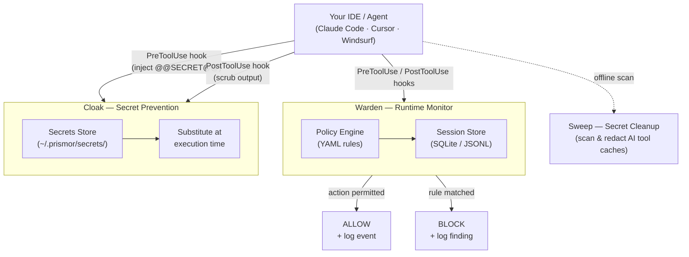

# Architecture

Prismor has three components that work together to protect AI coding agent sessions.

**Warden** hooks into the agent's tool-use pipeline and evaluates every command against your policy before it reaches the OS. If the policy says block, the shell never sees the command.

**Cloak** prevents secrets from entering model context. You register a real secret once under a placeholder. A PreToolUse hook substitutes the real value only at execution time, then scrubs it from captured output before the model sees it.

**Sweep** scans local config directories used by Claude, Cursor, Windsurf, Codex, and others for secrets that have already leaked into AI tool caches, then redacts or removes them.

## Data Flow

## Why not kernel-level security?

Kernel-level and endpoint security tools intercept syscalls after the agent has already constructed and dispatched the command. They have no context about why the agent issued it or what the user actually asked for. Warden operates upstream of that, at the agent hook layer, where blocking is safe and context is available.
